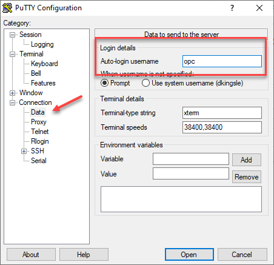
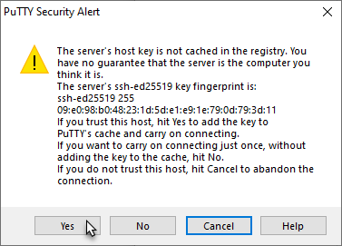
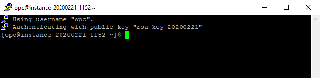

#  Multitenant Workshop setup

## OCI cloud account

This Lab uses Linux server with Oracle Software from Oracle Marketplace. We can get to this image by logging into Oracle Cloud.  The Lab is self driven and can the done in the following ways.

- Using Always Free account
- Using Your Oracle Cloud account


#### Always Free Account
If you are using the always free account, the free account gives access to Autonomous database and one OCPU VM server. For more information check out the  **[link](https://docs.cloud.oracle.com/en-us/iaas/Content/FreeTier/resourceref.htm)**. on how to get it.

#### Oracle Cloud Account
If you already have Cloud Account, then you will already have tenant name, username and password needed to login and provision a workshop server.


------------------------------------------------------------------------

To provision a OCI container with Multitenant Workshop template, you need to first create a OCI image from market place. For that you need to have a ssh public and private keys. If you don't have one, then follow the instructions below to generate a ssh key pair.
Once you have ssh key, you can provision the OCI container from  Marketplace.   
After provisioning the environment, you can connect to it using your private key.
run the setup script. This will download the latest setup scripts required for the Lab.

The Multitenant lab includes two container databases running:

- CDB1 running on port 1523
- CDB2 running on port 1524

## Generate an SSH Key Pair

If you already have an ssh key pair, you may use that to connect to your environment. Based on your laptop config, choose the appropriate step to connect to your instance.
For for information check out the **[link](https://github.com/oracle/learning-library/blob/master/common/labs/generate-ssh-key/generate-ssh-keys.md)**.
 The link also describes how to connect to Linux server once its provisioned. We will need to revist this once we have provisioned the SSH keys.


------


## Provision VM with19c Database software from Oracle Marketplace

From a browser go to **[ Workshop link]( https://cloudmarketplace.oracle.com/marketplace/listing/74094332)**.


Pick Region and Click **Sign In**


Pick the latest version, and accept the "terms and conditions" and Click  **Launch Instance**


Under "Create Compute Instance" enter the name for the workshop instance.


Add the **ssh** public key  and click **create**


That is it. We have successfully create a Multitenant Workshop Instance.
Check out the IP address of the provisioned server and ssh to it.
If you need help to configure client from Mac or Putty client to this server, please check the **[link](https://github.com/oracle/learning-library/blob/master/common/labs/generate-ssh-key/generate-ssh-keys.md)** if you need help.

The default user is "opc" and accessed by ssh private key. It does not have a password.

## Connecting to workshop instance using Putty
1.  Open the PuTTY utility from the Windows start menu.   In the dialog box, enter the IP Address of your OCI Compute Instance.  This can be obtained from the **OCI Console > Instance Details** screen.

    

2.  Under **Category** select **Connection** and then choose the **Data** field.  Enter the assigned username.  OCI instances will default to the username ```opc```.  Enter ```opc```.

    

3.  Under **Category**, navigate to **Connection** - **SSH** and choose the **Auth** category.   Click on the **Browse** button and locate the ```Private Key file``` you created in the earlier step.   Click the Open button to initiate the SSH connection to your cloud instance.

    

4. Click Session in the left navigation pane, then click Save in the Load, save or delete a stored session Step.

5.  Click **Yes** to bypass the Security Alert about the uncached key.

    

6.  Connection successful.   You are now securely connected to an OCI Cloud instance.

    

    You are now able to connect securely using the Putty terminal utility.   You can save the connection information for future use and configure PuTTY with your own custom settings.

## Connect from Mac
1. Run the following command to change the file permissions to 600 to secure the key. You can also set them to 400.

````
 chmod 600 labkey.ppk
 ````
2. Use the key to log in to the SSH client as shown in the following example, which loads the key in file labkey.ppk, and logs in as user to IP Address. Eg.
````
ssh -i lapkey.ppk oracle@192.237.248.66

````
## Run the Setup Scripts as oracle
if you connected with username  opc, then sudo to oracle user.
````
sudo su - oracle
````

````
<copy>
cd /home/oracle
wget https://objectstorage.us-phoenix-1.oraclecloud.com/n/oraclepartnersas/b/Multitenant/o/labs.zip
chown oracle:oinstall /home/oracle/labs.zip
unzip -o labs.zip
chmod -R +x /home/oracle/labs
/home/oracle/labs/multitenant/resetCDB.sh
</copy>
````
