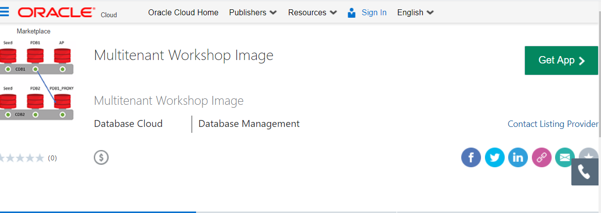
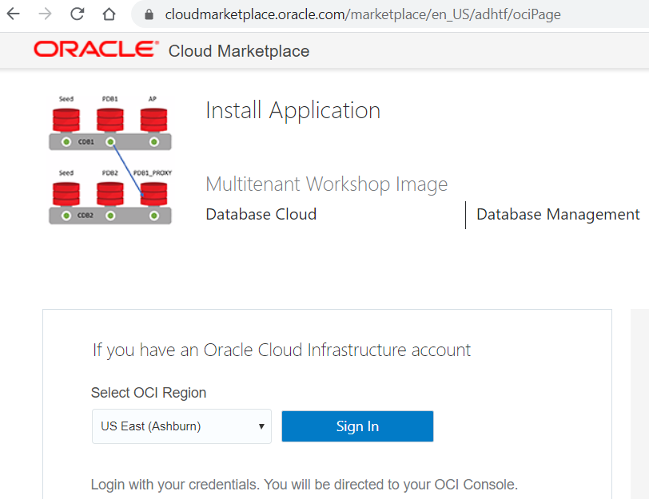
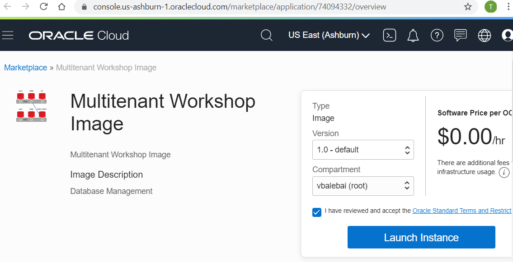
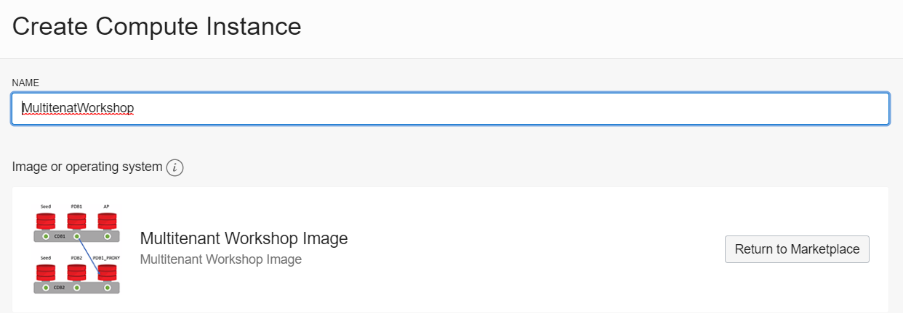
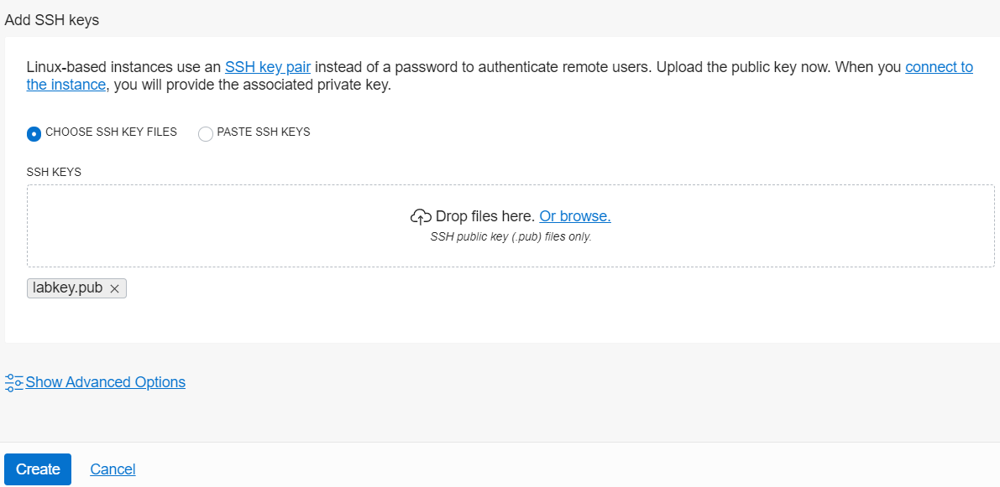

#  Multitenant Workshop setup

## OCI cloud account

This Lab uses Linux server with Oracle Software from Oracle Marketplace. We can get to this image by logging into Oracle Cloud.  The Lab is self driven and can the done in the following ways.

- Using Always Free account
- Using Your Oracle Cloud account


#### Always Free Account
If you are using the always free account, the free account gives access to Autonomous database and one OCPU VM server. For more information check out the  **[link](https://docs.cloud.oracle.com/en-us/iaas/Content/FreeTier/resourceref.htm)**. on how to get it.

#### Oracle Cloud Account
If you already have Cloud Account, then you will already have tenant name, username and password needed to login and provision a workshop server.


------------------------------------------------------------------------


## Generate an SSH Key Pair

If you already have an ssh key pair, you may use that to connect to your environment. Based on your laptop config, choose the appropriate step to connect to your instance.
For for information check out the **[link](https://github.com/oracle/learning-library/blob/master/common/labs/generate-ssh-key/generate-ssh-keys.md)**.
 The link also describes how to connect to Linux server once its provisioned. We will need to revist this once we have provisioned the SSH keys.


------


## Provision VM with19c Database software from Oracle Marketplace

From a browser go to **[ Workshop link]( https://cloudmarketplace.oracle.com/marketplace/listing/74094332)**.



Pick Region and Click **Sign In**


Pick the latest version, and accept the "terms and conditions" and Click  **Launch Instance**


Under "Create Compute Instance" enter the name for the workshop instance.


Add the **ssh** public key  and click **create**



That is it. We have successfully create a Multitenant Workshop Instance.
Check out the IP address of the provisioned server and ssh to it.
If you need help to configure client from Mac or Putty client to this server, please check the **[link](https://github.com/oracle/learning-library/blob/master/common/labs/generate-ssh-key/generate-ssh-keys.md)** if you need help.

The default user is "opc" and accessed by ssh private key. It does not have a password.


## Run the Setup Scripts

 Copy the following commands into your terminal.
   ```
   <copy>cd /home/opc/
   wget https://objectstorage.us-phoenix-1.oraclecloud.com/n/oraclepartnersas/b/Multitenant/o/multiscripts.zip
   unzip multiscripts.zip; chmod +x *.sh
   /home/opc/setupenv.sh </copy>
   ````
   Now you have the environment to run the Multitenant labs.
The Lab includes two container databases running:

- CDB1 running on port 1523
- CDB2 running on port 1524

### Lab Setup

All the scripts for this lab are located in the /u01/app/oracle/labs/multitenant folder.

1. To access the scripts, secure shell into the OCI compute instance.

2. Change to the ssh directory and ssh into your instance. The public IP address can be found by going to Compute -> Instance.

   ```
   cd .ssh
   ssh -i optionskey opc@<your public ip address>
   ls
   sudo su - oracle
   cd /home/oracle/labs/multitenant
   ```
