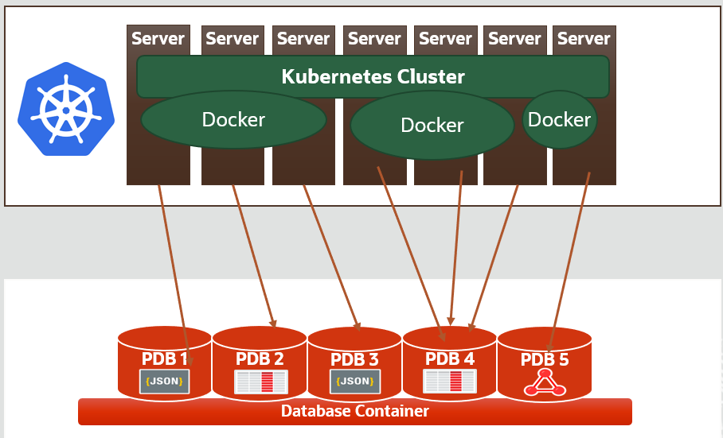

# Oracle Multitenant workshop

## Workshop Overview

**[Oracle Multitenant](https://github.com/oracle/learning-library/issues)** is the architecture for the next-generation database cloud. It delivers isolation, agility and economies of scale. A multitenant container database can hold many pluggable databases. An existing database can simply be adopted with no application changes required. Oracle Multitenant fully complements other options, including Oracle Real Application Clusters and Oracle Active Data Guard.

This hands-on workshop focuses on
* Multitenant Basics : This is a 4 hour workshop that helps DBAs to perform operations as below.
    * Create, Drop, Unplug and Plug PDBs.
    * Includes Hot clone, PDB refresh and PDB relocate.
* Multitenant Tenant Isolation : This is a 2 hour workshop. It helps DBAs mange resource allocation, isolation of pluggable database.
    * Isolation features like Database Firewall and LOCKDOWN.
    * Memory, CPU and IO isolation.
* Multitenant Application Containers : This is a 3 hour workshop. Once the Basic is mastered, DBAs can architect the application to take advantage of Multitenant specific features.
        * Application Architecture, Upgrde, Porxy PDBs , Syncronizing Application and Version control.

## Workshop Requirements

* Access to Oracle Cloud Infrastructure
    * Provided by the instructor for instructor-led workshops
* Access to a laptop or a desktop
    * To access the OCI server through tools like putty and sqldeveloper.

## Multitenant Data Consolidation and Modernization.

###  Bridging the GAP between Dev and DBAs

#### BACKGROUND

It is common to see software and hardware platforms evolve over time to be more efficient and performant at lower cost. Deployment environments using Hardware and software frameworks like Kubernetes and Docker are taking away market share from traditional Virtual Images and standalone servers.

In terms of development paradigm, Organizations are moving from Monolithic Application architecture to MicroServices and CICD ( Continuous Integration Continuous Deployments ) delivery models.

In terms of Datatype, the adoption of multiple formats like XML, JSON, Relational tables, Text docs, Spacial, Big Data , IOTs and NOSQL are getting popular.

With the proliferation of multiple players, we see (a) a plethora of data formats such as XML, JSON,(b)Data storage formats such as Spatial.

These modern approaches  are  mushrooming because it is easy to setup and accessible due to Cloud providers who readily provide the platform services.

However, this phenomenon has led to multiple issues and inefficiencies, Some of the top issue are highlighted below.

#### PROBLEM STATEMENT

We have witnessed in several customer scenarios, where the DBA is not involved in the design of the modern application. While DevOps attempts to break the silos between development and operations, there is a dire need to bring developers and DBAs together.

In a customer environment with  multiple  services dependent on heterogeneous "single trick pony" databases, these are the key problems that surface.

- High Total Cost of Ownership.
- Challenges in assuring High Availability, Security, Elasticity and Performance.
- Need for practitioners proficient in multiple  technology for data store.
- Cumbersome and time consuming mechanism  to move data across data stores.
- Inability to leverage existing DBA capability in the organization.
- Unproven technical support for mission critical production systems.

#### RECOMMENDED BLUE PRINT

In line with the evolution of  modern application architectures, Oracle has ensured continuous innovation to be ahead of the curve. Oracle provides a solution architecture that is agnostic of development environment and data representation format.

This is where Oracle Database Multitenant and DB features comes into play. Oracle DB has the native capability to support all the Modern representation formats like JSON, XML, Big data format like parquet files, Text docs, Spatial, etc.
Consolidating the data store, helps us clearly establish the segregation of responsibilities for developers & DBAs, thereby enabling the DBA to focus on  assuring database Reliability, Scalability, Availability and Security.

Oracle Pluggable database (PDB) provides an elegant model that

- can establish either "one to one" OR "consolidated" mapping for micro services in containerized environments
- can facilitate automated provisioning   of instances for developers
- helps Developers build solutions with confidence & with the assurance of reliable data store
- can scale upto 4000 instances in a cost efficient manner
- provides a flexible model where in one can either isolate or aggregate the instances depending on the need.

#### **Solution Use case :**  
The  use case below clearly illustrates the possibility of achieving  a High availability architecture at all levels of the solution stack.

- Kubernetes in a docker container environment managed by Developers
- Backend Oracle managed by DBAs

#### NEXT STEPS
As of 2020, Oracle has over 24+ dataceters worldwide and integrated Kubernetes into Cloud infrastructure.
There is a seperate **[workshop](https://github.com/oracle/learning-library/blob/master/common/labs/generate-ssh-key/generate-ssh-keys.md#connecting-to-an-instance-using-putty)** on Oracle Container Engine for Kubernetes (sometimes abbreviated to just OKE).
