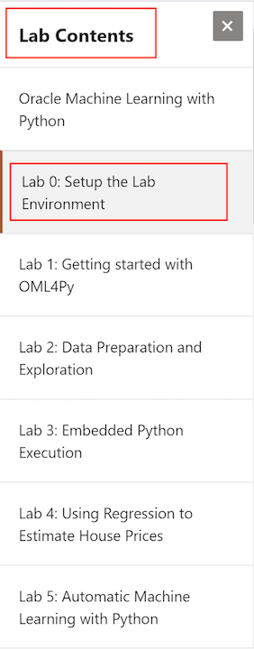

# Oracle Multitenant workshop

## Workshop Overview

**[Oracle Multitenant](https://github.com/oracle/learning-library/issues)** is the architecture for the next-generation database cloud. It delivers isolation, agility and economies of scale. A multitenant container database can hold many pluggable databases. An existing database can simply be adopted with no application changes required. Oracle Multitenant fully complements other options, including Oracle Real Application Clusters and Oracle Active Data Guard.

This hands-on workshop focuses on
* Multitenant Basics : This is a 4 hour workshop that helps DBAs to perform operations as below.
    * Create, Drop, Unplug and Plug PDBs.
    * Includes Hot clone, PDB refresh and PDB relocate.
* Multitenant Application Containers : This is a 3 hour workshop. Once the Basic is mastered, DBAs can architect the application to take advantage of Multitenant specific features.
    * Application Architecture, Upgrde, Porxy PDBs , Syncronizing Application and Version control.
* Multitenant Tenant Isolation : Helps DBA mange resource allocation, isolation of pluggable database.
    * Isolation features like Database Firewall
    * Memory, CPU and IO isolation.

## Workshop Requirements 12345

* Access to Oracle Cloud Infrastructure
    * Provided by the instructor for instructor-led workshops
* Access to a laptop or a desktop
    * To access the OCI server through tools like putty and sqldeveloper.

## Access the labs

- Use **Lab Contents** menu on your right to access the labs.
    - If the menu is not displayed, click the menu button  on the top right  make it visible.

- From the menu, click on the lab that you like to proceed with. For example, if you like to proceed to **Lab 0**, click **Lab 0: Setup the Lab Environment**.

- You may close the menu by clicking 
