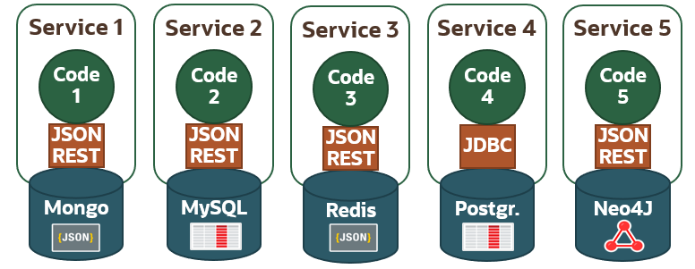

# Oracle Multitenant workshop

## Workshop Overview

**[Oracle Multitenant](https://github.com/oracle/learning-library/issues)** is the architecture for the next-generation database cloud. It delivers isolation, agility and economies of scale. A multitenant container database can hold many pluggable databases. An existing database can simply be adopted with no application changes required. Oracle Multitenant fully complements other options, including Oracle Real Application Clusters and Oracle Active Data Guard.

This hands-on workshop focuses on
* Multitenant Basics : This is a 4 hour workshop that helps DBAs to perform operations as below.
    * Create, Drop, Unplug and Plug PDBs.
    * Includes Hot clone, PDB refresh and PDB relocate.
* Multitenant Application Containers : This is a 3 hour workshop. Once the Basic is mastered, DBAs can architect the application to take advantage of Multitenant specific features.
    * Application Architecture, Upgrde, Porxy PDBs , Syncronizing Application and Version control.
* Multitenant Tenant Isolation : Helps DBA mange resource allocation, isolation of pluggable database.
    * Isolation features like Database Firewall
    * Memory, CPU and IO isolation.

## Workshop Requirements

* Access to Oracle Cloud Infrastructure
    * Provided by the instructor for instructor-led workshops
* Access to a laptop or a desktop
    * To access the OCI server through tools like putty and sqldeveloper.

## Multitenant Data Consonsolidtion for mordern architecture.

###  Value proposition for Multitenant
It is common to see Software and Hardware platform evole over time to be more efficiancy and performant at lower cost.
Deployment  environments using Hardware and sofware frameworks like Kubernites and Docker are taking away market share from treditional Virtual Images and Bear-Metal servers.
In terme of Development paradim, people are moving from Single Monolitic Application to MicroServices and Continous Development and deployment models.
In terms of Datatype, the adoption of multiple formats like XML, JSON, Relation tabales ,text docs , spacial, Big Data , IOTs and NOSQL are getting popular.
These modern designs are quickly becoming popular because it is easly to setup and accessible due to Cloud providers who readily provide the platform services.
A problem arises in these designs if a DBA of a production sytem is not involved in the Design of the newer applications. If a Database to store data is kept close to the thin application layer and have different DB stores for different formats, it usually becomes App tier heavy and will consume more CPU resources and more managements steps to tune,Upgrade and provide High avaibility, Disaster Recovery and scalability. Often, the DBA now has to handle and be proficient in more than one Data Stores.

This is where Oracle Database Multitenant and DB features comes into play. Oracle DB has the ability to store all the Modern Datatypes like JSON, XML, IOTs, nosql, Big data format like parque files, Text docs, Spacial all within the DB. In addition , it has built in features of partitioning,  Multitenant feature can help address the Modern archtecture of thin application frameworks in Dockers access a single PDB 
