# Multitenant Basics  

## Introduction
In this lab you will perform many multitenant basic tasks.  You will create a pluggable database (PDB), make a copy of this pluggable database, or clone it, explore the concepts of "plugging" and unplugging a PDB and finally drop it.  You will then explore the concepts of cloning unplugged databases and databases that are hot or active. Finally you will work on refresh, snapshots and relocate PDBs.

[](youtube:kzTQGs75IjA)

## Step 1: Create PDB
This section looks at how to create a new PDB.

The tasks you will accomplish in this lab are:
- Create a pluggable database **PDB2** in the container database **CDB1**  

1. Connect to **CDB1**  

    ````
    <copy>
    sqlplus /nolog
    connect sys/oracle@localhost:1523/cdb1 as sysdba
    </copy>
    ````

2. Check to see who you are connected as. At any point in the lab you can run this script to see who or where you are connected.  

    ````

    <copy>select
  'DB Name: '  ||Sys_Context('Userenv', 'DB_Name')||
  ' / CDB Name: '   ||Sys_Context('Userenv', 'CDB_NAME')||
  ' / Auth-ID: '   ||Sys_Context('Userenv', 'Authenticated_Identity')||
  ' / Sessn-User: '||Sys_Context('Userenv', 'Session_User')||
  ' / Container: ' ||Nvl(Sys_Context('Userenv', 'Con_Name'), 'n/a')
  "Who am I?"
  from Dual
/ </copy>

    ````

    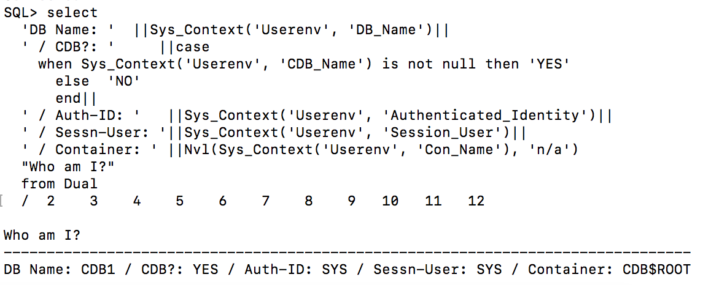

   To save the above query as a script , save from the sql prompt.
    ````
    <copy>save whoami.sql</copy>
    ````
    Re run the query through the script.
    ````
    <copy>@whoami.sql</copy>
    ````

3. Create a pluggable database **PDB2**.  

    ````
    <copy>
    show  pdbs;
    create pluggable database PDB2 admin user PDB_Admin identified by oracle;
    alter pluggable database PDB2 open;
    show pdbs;
    </copy>
    ````
    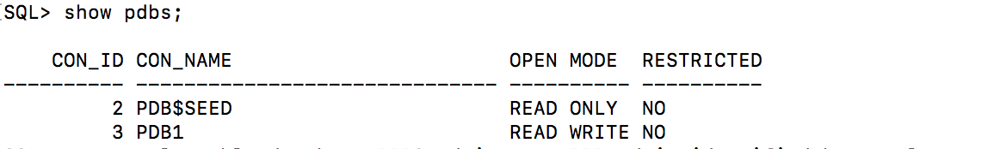

    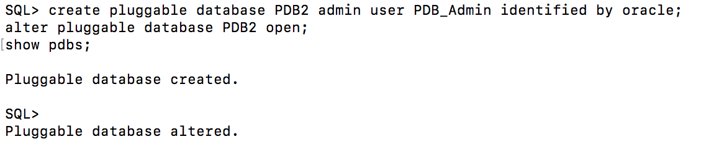

    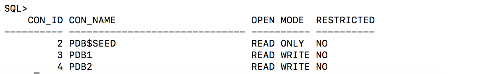

4. Change the session to point to **PDB2**.  

    ````
    <copy>alter session set container = PDB2;</copy>
    ````
   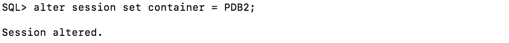

5. Grant **PDB_ADMIN** the necessary privileges and create the **USERS** tablespace for **PDB2**.  

    ````
    <copy>
    grant sysdba to pdb_admin;
    create tablespace users datafile size 20M autoextend on next 1M maxsize unlimited segment space management auto;
    alter database default tablespace Users;
    grant create table, unlimited tablespace to pdb_admin;
    </copy>
    ````

   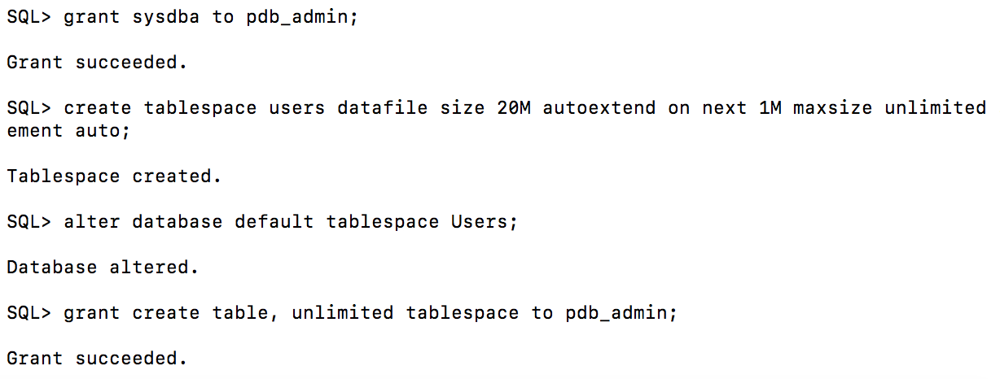

6. Connect as **PDB_ADMIN** to **PDB2**.  

    ````
    <copy>connect pdb_admin/oracle@localhost:1523/pdb2</copy>
    ````

7. Create a table **MY_TAB** in **PDB2**.  

    ````
    <copy>create table my_tab(my_col number);
    insert into my_tab values (1);
    commit;</copy>
    ````

   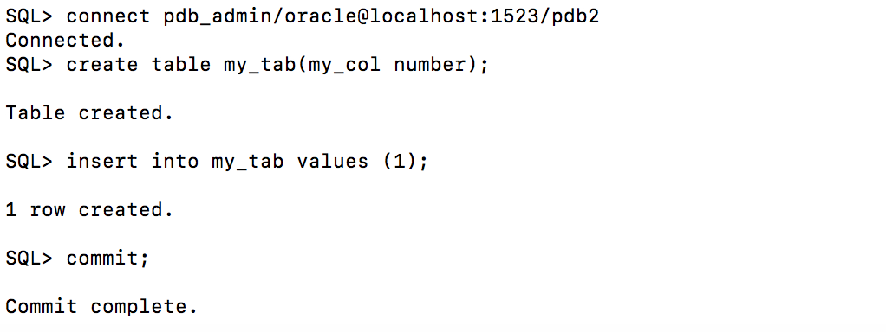

8. Change back to **SYS** in the container database **CDB1** and show the tablespaces and datafiles created.  

    ````
    <copy>
    connect sys/oracle@localhost:1523/cdb1 as sysdba

    COLUMN "Con_Name" FORMAT A10
    COLUMN "T'space_Name" FORMAT A12
    COLUMN "File_Name" FORMAT A120
    SET LINESIZE 220
    SET PAGES 9999

    with Containers as (
      select PDB_ID Con_ID, PDB_Name Con_Name from DBA_PDBs
      union
      select 1 Con_ID, 'CDB$ROOT' Con_Name from Dual)
    select
      Con_ID,
      Con_Name "Con_Name",
      Tablespace_Name "T'space_Name",
      File_Name "File_Name"
    from CDB_Data_Files inner join Containers using (Con_ID)
    union
    select
      Con_ID,
      Con_Name "Con_Name",
      Tablespace_Name "T'space_Name",
      File_Name "File_Name"
    from CDB_Temp_Files inner join Containers using (Con_ID)
    order by 1, 3
    /
    </copy>
    ````
   


## Step 2: Clone a PDB
This section looks at how to clone a PDB

The tasks you will accomplish in this lab are:
- Clone a pluggable database **PDB2** into **PDB3**


1. Connect to **CDB1**.  

    ````
    <copy>sqlplus /nolog
    connect sys/oracle@localhost:1523/cdb1 as sysdba</copy>
    ````

2. Change **PDB2** to read only.  

    ````
    <copy>alter pluggable database PDB2 open read only force;
    show pdbs</copy>
    ````

   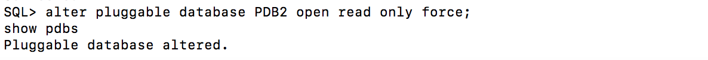

   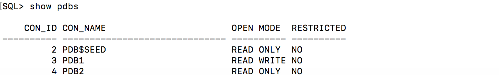

3. Create a pluggable database **PDB3** from the read only database **PDB2**.  

    ````
    <copy>create pluggable database PDB3 from PDB2;
    alter pluggable database PDB3 open force;
    show pdbs</copy>
    ````
   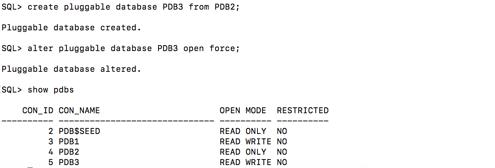

4. Change **PDB2** back to read write.  

    ````
    <copy>alter pluggable database PDB2 open read write force;
    show pdbs</copy>
    ````
   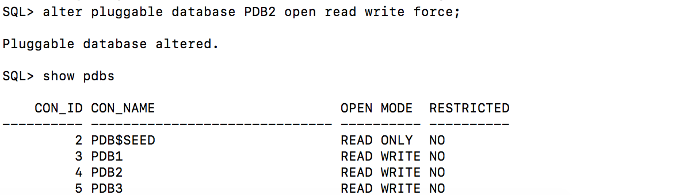

5. Connect to **PDB2** and show the table **MY_TAB**.  

    ````
    <copy>connect pdb_admin/oracle@localhost:1523/pdb2
    select * from my_tab;</copy>
    ````

   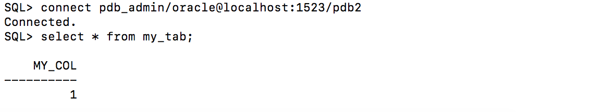

6. Connect to **PDB3** and show the table **MY_TAB**.  

    ````
    <copy>connect pdb_admin/oracle@localhost:1523/pdb3
    select * from my_tab;</copy>
    ````
   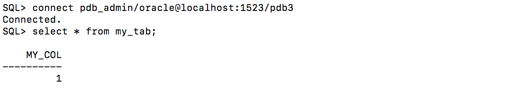

## Step 3: Unplug a PDB
This section looks at how to unplug a PDB

The tasks you will accomplish in this lab are:
- Unplug **PDB3** from **CDB1**

1. Connect to **CDB1**.  

    ````
    sqlplus /nolog
    connect sys/oracle@localhost:1523/cdb1 as sysdba
    ````

2. Unplug **PDB3** from **CDB1**.  

    ````
    <copy>show pdbs
    alter pluggable database PDB3 close immediate;

    alter pluggable database PDB3
    unplug into
    '/u01/app/oracle/oradata/CDB1/pdb3.xml';

    show pdbs </copy>
    ````

   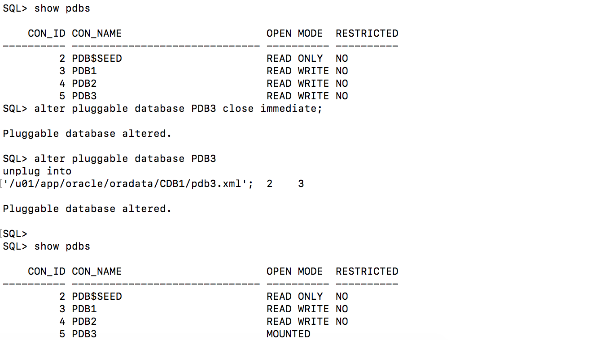

3. Remove **PDB3** from **CDB1**.  

    ````
    <copy>drop pluggable database PDB3 keep datafiles;

    show pdbs</copy>
    ````

   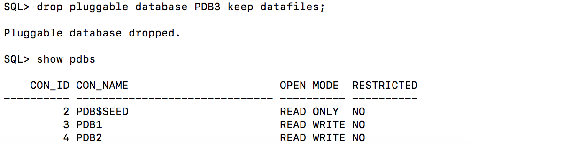

4. Show the datafiles in **CDB1**.  

    ````
    <copy>
    COLUMN "Con_Name" FORMAT A10
    COLUMN "T'space_Name" FORMAT A12
    COLUMN "File_Name" FORMAT A120
    SET LINESIZE 220
    SET PAGES 9999

    with Containers as (
      select PDB_ID Con_ID, PDB_Name Con_Name from DBA_PDBs
      union
      select 1 Con_ID, 'CDB$ROOT' Con_Name from Dual)
    select
      Con_ID,
      Con_Name "Con_Name",
      Tablespace_Name "T'space_Name",
      File_Name "File_Name"
    from CDB_Data_Files inner join Containers using (Con_ID)
    union
    select
      Con_ID,
      Con_Name "Con_Name",
      Tablespace_Name "T'space_Name",
      File_Name "File_Name"
    from CDB_Temp_Files inner join Containers using (Con_ID)
    order by 1, 3
    /
    </copy>
    ````

    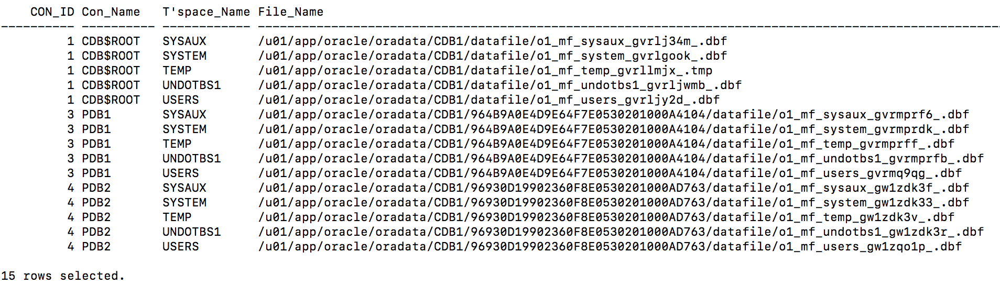

5. Look at the XML file for the pluggable database **PDB3**.  

    ````
    <copy>host cat /u01/app/oracle/oradata/CDB1/pdb3.xml</copy>
    ````
    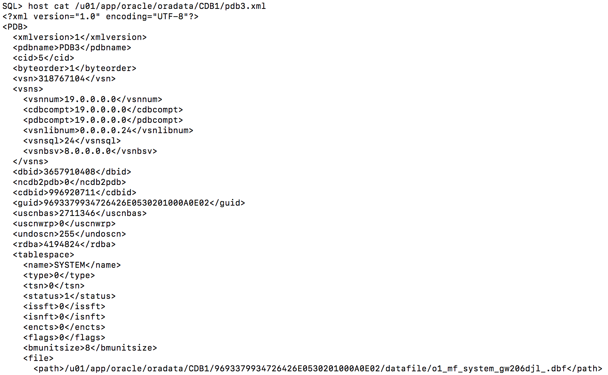


## Step 4: Plug in a PDB
This section looks at how to plug in a PDB

The tasks you will accomplish in this lab are:
- Plug **PDB3** into **CDB2**

1. Connect to **CDB2**  

    ````
    sqlplus /nolog
    connect sys/oracle@localhost:1524/cdb2 as sysdba

    COLUMN "Who am I?" FORMAT A120
    select
      'DB Name: '  ||Sys_Context('Userenv', 'DB_Name')||
      ' / CDB?: '     ||case
        when Sys_Context('Userenv', 'CDB_Name') is not null then 'YES'
        else 'NO'
        end||
      ' / Auth-ID: '   ||Sys_Context('Userenv', 'Authenticated_Identity')||
      ' / Sessn-User: '||Sys_Context('Userenv', 'Session_User')||
      ' / Container: ' ||Nvl(Sys_Context('Userenv', 'Con_Name'), 'n/a')
      "Who am I?"
    from Dual
    /

    show pdbs
    ````
    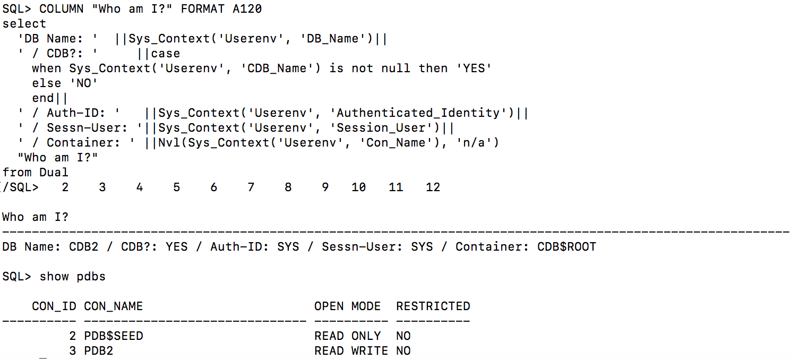

     If you have saved the query as whoami.sql earlier, you can run the query as below.
     ````
     <copy>@whoami.sql</copy>
     ````


2. Check the compatibility of **PDB3** with **CDB2**  

    ````
    <copy>
    begin
      if not
        Sys.DBMS_PDB.Check_Plug_Compatibility
        ('/u01/app/oracle/oradata/CDB1/pdb3.xml')
      then
        Raise_Application_Error(-20000, 'Incompatible');
      end if;
    end;
    /   
    </copy>
    ````
   If script executes without feedback or exception then it IS COMPATIBLE.


3. Plug **PDB3** into **CDB2**  

    ````
      <copy>create pluggable database PDB3
    using '/u01/app/oracle/oradata/CDB1/pdb3.xml'
    move;

    show pdbs
    alter pluggable database PDB3 open;
    show pdbs   </copy>
    ````

    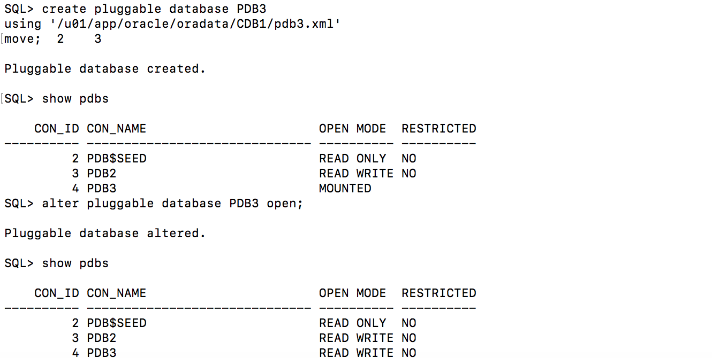

4. Review the datafiles in **CDB2**  

    ````
      <copy>
    COLUMN "Con_Name" FORMAT A10
    COLUMN "T'space_Name" FORMAT A12
    COLUMN "File_Name" FORMAT A120
    SET LINESIZE 220
    SET PAGES 9999


    with Containers as (
      select PDB_ID Con_ID, PDB_Name Con_Name from DBA_PDBs
      union
      select 1 Con_ID, 'CDB$ROOT' Con_Name from Dual)
    select
      Con_ID,
      Con_Name "Con_Name",
      Tablespace_Name "T'space_Name",
      File_Name "File_Name"
    from CDB_Data_Files inner join Containers using (Con_ID)
    union
    select
      Con_ID,
      Con_Name "Con_Name",
      Tablespace_Name "T'space_Name",
      File_Name "File_Name"
    from CDB_Temp_Files inner join Containers using (Con_ID)
    order by 1, 3
    /   </copy>
    ````

    

5. Connect as **PDB\_ADMIN** to **PDB3** and look at **MY\_TAB**;  

    ````
    <copy>connect pdb_admin/oracle@localhost:1524/pdb3

    select * from my_tab</copy>
    ````

    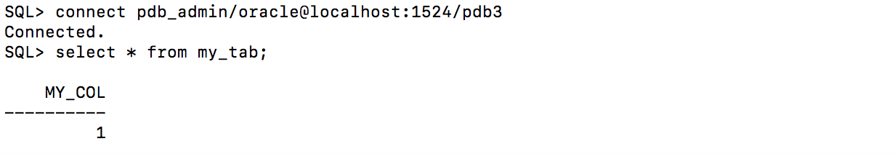

## Step 5: Drop a PDB
This section looks at how to drop a pluggable database.

The tasks you will accomplish in this lab are:
- Drop **PDB3** from **CDB2**

1. Connect to **CDB2**  

    ````
    sqlplus /nolog
    connect sys/oracle@localhost:1524/cdb2 as sysdba
    ````

2. Drop **PDB3** from **CDB2**  

    ````
  <copy>  show pdbs

    alter pluggable database PDB3 close immediate;

    drop pluggable database PDB3 including datafiles;

    show pdbs</copy>
    ````

    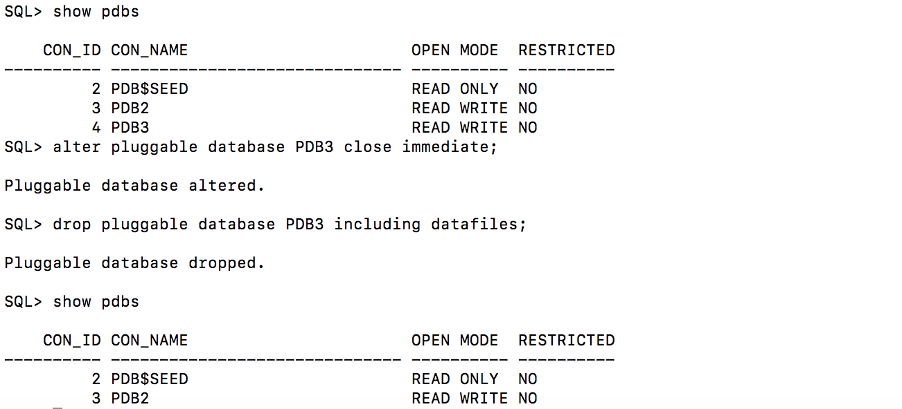


## Step 6: Clone an Unplugged PDB
This section looks at how to create a gold copy of a PDB and clone it into another container.

The tasks you will accomplish in this lab are:
- Create a gold copy of **PDB2** in **CDB1** as **GOLDPDB**
- Clone **GOLDPDB** into **COPYPDB1** and **COPYPDB2** in **CDB2**

1. Connect to **CDB1**  

    ````
    sqlplus /nolog
    connect sys/oracle@localhost:1523/cdb1 as sysdba
    ````

2. Change **PDB2** to read only  

    ````
    <copy>alter pluggable database PDB2 open read only force;
    show pdbs</copy>
    ````

3. Create a pluggable database **GOLDPDB** from the read only database **PDB2**  

    ````
    <copy>create pluggable database GOLDPDB from PDB2;
    alter pluggable database GOLDPDB open force;
    show pdbs</copy>
    ````

    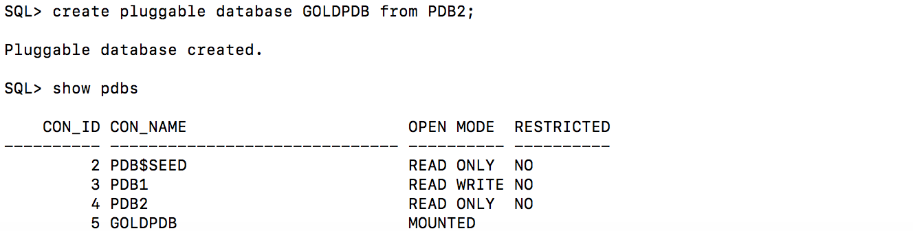

4. Change **PDB2** back to read write  

    ````
    <copy>alter pluggable database PDB2 open read write force;
    show pdbs
    </copy>
    ````

    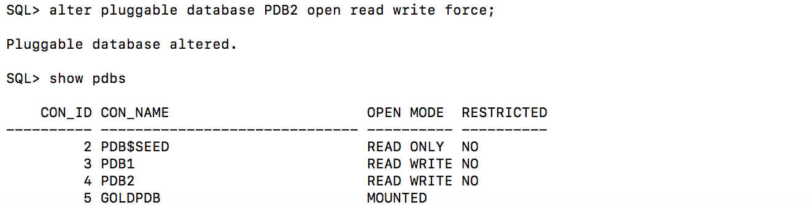

5. Unplug **GOLDPDB** from **CDB1**  

    ````
    <copy>
    show pdbs
    alter pluggable database GOLDPDB close immediate;

    alter pluggable database GOLDPDB
    unplug into '/u01/app/oracle/oradata/CDB1/goldpdb.xml';

    show pdbs
    </copy>
    ````

    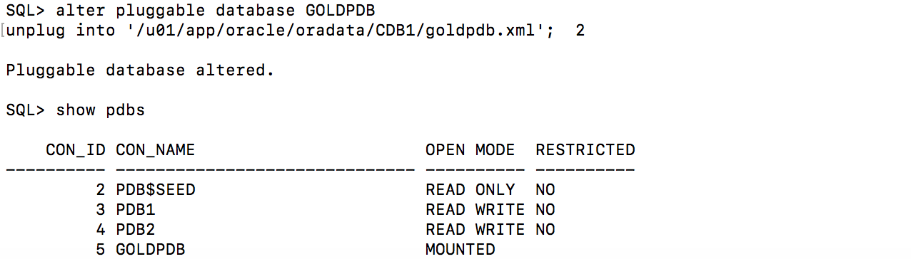

6. Remove **GOLDPDB** from **CDB1**  

    ````
    <copy>drop pluggable database GOLDPDB keep datafiles;

    show pdbs</copy>
    ````

7. Connect to **CDB2**  

    ````
    <copy>connect sys/oracle@localhost:1524/cdb2 as sysdba</copy>
    ````

8. Validate **GOLDPDB** is compatibile with **CDB2**  

    ````
    <copy>
    begin
      if not
        Sys.DBMS_PDB.Check_Plug_Compatibility
    ('/u01/app/oracle/oradata/CDB1/goldpdb.xml')
      then
        Raise_Application_Error(-20000, 'Incompatible');
      end if;
    end;
    /
    </copy>
    ````

9. Create a clone of **GOLDPDB** as **COPYPDB1**  

    ````
    <copy>
    create pluggable database COPYPDB1 as clone
    using '/u01/app/oracle/oradata/CDB1/goldpdb.xml'
    storage (maxsize unlimited max_shared_temp_size unlimited)
    copy;
    show pdbs
    </copy>
    ````

    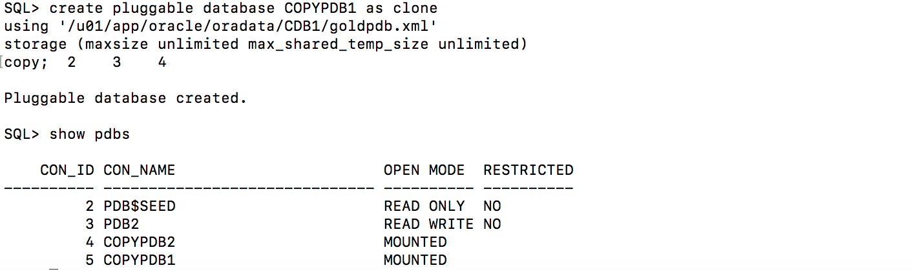

10. Create another clone of **GOLDPDB** as **COPYPDB2**  

    ````
    <copy>
    create pluggable database COPYPDB2 as clone
    using '/u01/app/oracle/oradata/CDB1/goldpdb.xml'
    storage (maxsize unlimited max_shared_temp_size unlimited)
    copy;
    show pdbs
    </copy>
    ````

    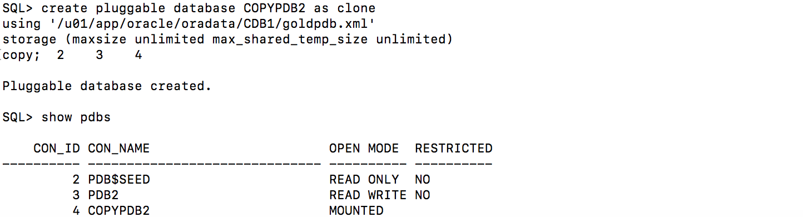

11. Open all of the pluggable databases  

    ````
    <copy>alter pluggable database all open;

    show pdbs</copy>
    ````
    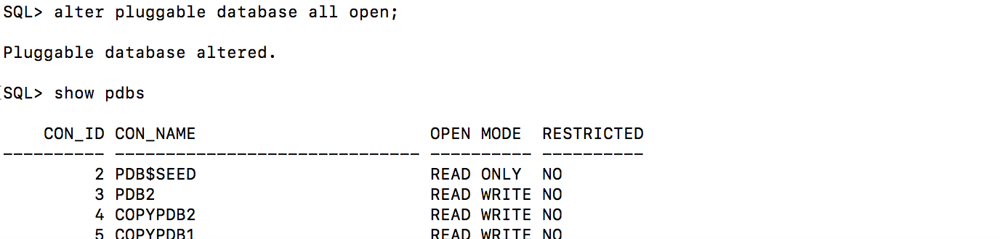

12. Look at the GUID for the two cloned databases  

    ````
    <copy>
    COLUMN "PDB Name" FORMAT A20
    select PDB_Name "PDB Name", GUID
    from DBA_PDBs
    order by Creation_Scn
    /
    </copy>
    ````
    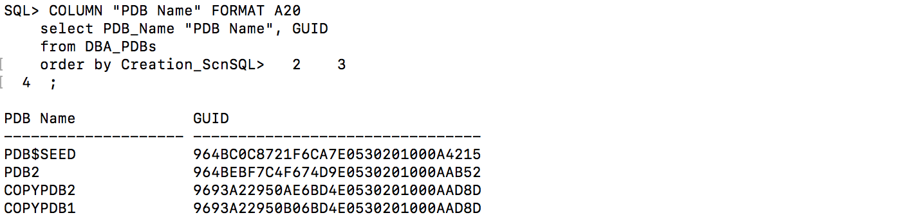

## Step 7: PDB Hot Clones
This section looks at how to hot clone a pluggable database.

The tasks you will accomplish in this lab are:
- Create a pluggable database **OE** in the container database **CDB1**
- Create a load against the pluggable database **OE**
- Create a hot clone **OE_DEV** in the container database **CDB2** from the pluggable database **OE**

[](youtube:djp-ogM71oE)

1. Connect to **CDB1**  

    ````
    sqlplus /nolog
    connect sys/oracle@localhost:1523/cdb1 as sysdba
    ````

2. Create a pluggable database **OE** with an admin user of **SOE**  

    ````
    <copy>
    create pluggable database oe admin user soe identified by soe roles=(dba);
    alter pluggable database oe open;
    alter session set container = oe;
    grant create session, create table to soe;
    alter user soe quota unlimited on system; </copy>
    ````
    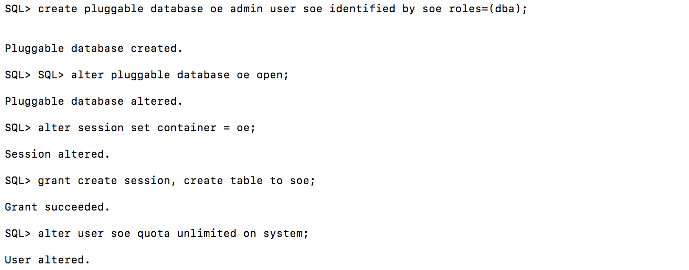

3. Connect as **SOE** and create the **sale_orders** table  


    ````
    <copy>
    connect soe/soe@localhost:1523/oe
    CREATE TABLE sale_orders
    (ORDER_ID      number,
    ORDER_DATE    date,
    CUSTOMER_ID   number);
    </copy>
    ````

 4. Open a **new terminal window**, sudo to the oracle user and execute write-load.sh. Leave this window open and running throughout the rest of the multitenant labs.  

     ````
    <copy>
    sudo su - oracle
    cd /home/oracle/labs/multitenant
    ./write-load.sh
    </copy>
    ````
    Leave this window open and running for the next few labs.

5. Go back to your original terminal window.  Connect to **CDB2** and create the pluggable **OE\_DEV** from the database link **oe@cdb1\_link**  

    ````
    <copy>
    connect sys/oracle@localhost:1524/cdb2 as sysdba
    create pluggable database oe_dev from oe@cdb1_link;
    alter pluggable database oe_dev open;
    </copy>
    ````

6. Connect as **SOE** to **OE\_DEV** and check the number of records in the **sale\_orders** table  

    ````
    <copy>
    connect soe/soe@localhost:1524/oe_dev
    select count(*) from sale_orders;
    </copy>
    ````

7. Connect as **SOE** to **OE** and check the number of records in the **sale_orders** table  

    ````
    <copy>
    connect soe/soe@localhost:1523/oe
    select count(*) from sale_orders;
    </copy>
    ````

8. Close and remove the **OE_DEV** pluggable database  

    ````
    <copy>
    connect sys/oracle@localhost:1524/cdb2 as sysdba
    alter pluggable database oe_dev close;
    drop pluggable database oe_dev including datafiles;
    </copy>
    ````

9. Leave the **OE** pluggable database open with the load running against it for the rest of the labs.

You can see that the clone of the pluggable database worked without having to stop the load on the source database. In the next lab you will look at how to refresh a clone.

## Step 8: PDB Refresh
This section looks at how to hot clone a pluggable database, open it for read only and then refresh the database.

[](youtube:L9l7v6dH-e8)

The tasks you will accomplish in this lab are:
- Leverage the **OE** pluggable database from the previous lab with the load still running against it.
- Create a hot clone **OE_REFRESH**` in the container database **CDB2** from the pluggable database **OE**
- Refresh the **OE_REFRESH**` pluggable database.

1. Connect to **CDB2**  

    ````
    <copy>
    sqlplus /nolog
    connect sys/oracle@localhost:1524/cdb2 as sysdba
    </copy>
    ````

2. Create a pluggable database **OE\_REFRESH** with manual refresh mode from the database link **oe@cdb1\_link**  

    ````
    <copy>
    create pluggable database oe_refresh from oe@cdb1_link refresh mode manual;
    alter pluggable database oe_refresh open read only;
    </copy>
    ````

3. Connect as **SOE** to the pluggable database **OE\_REFRESH** and count the number of records in the sale\_orders table  

    ````
    <copy>
    conn soe/soe@localhost:1524/oe_refresh
    select count(*) from sale_orders;
    </copy>
    ````

4. Close the pluggable database **OE_REFRESH**` and refresh it from the **OE** pluggable database  

    ````
    <copy>
    conn sys/oracle@localhost:1524/oe_refresh as sysdba

    alter pluggable database oe_refresh close;

    alter session set container=oe_refresh;
    alter pluggable database oe_refresh refresh;
    alter pluggable database oe_refresh open read only;
    </copy>
    ````

5. Connect as **SOE** to the pluggable databse **OE\_REFRESH** and count the number of records in the **sale\_orders** table. You should see the number of records change.  

    ````
    <copy>
    conn soe/soe@localhost:1524/oe_refresh
    select count(*) from sale_orders;
    </copy>
    ````
Observe that the count of sale_orders has increased after the refresh.

## Step 9: Snapshot Copy

You can create a snapshot copy PDB by executing a CREATE PLUGGABLE DATABASE ... FROM ... SNAPSHOT COPY statement. The source PDB is specified in the FROM clause.

A snapshot copy reduces the time required to create the clone because it does not include a complete copy of the source data files. Furthermore, the snapshot copy PDB occupies a fraction of the space of the source PDB. The snapshot copy can be created in any filesystem like ext3, ext4, ntfs for local disks. It also supports NFS, ZSF, ACFS,etc.

The two main requirements for snapshot copy to work are
- CLONEDB initialization parameter should be set to TRUE.
- The source PDB is in Read Only mode.

Creating a snapshot copy of  refreshable PDB is a good use case for snapshot copy PDBs. Refreshable PDBs need to in read only mode in order to refresh. However, you can quickly create snapshots from there and use it for reporting, test and dev environments.
The refreshable PDB OE_REFRESH is the source PDB for snapshots and is always in read only mode.

1. Verify that the initialization parameter CLONEDB is set.
    ````
    <copy>connect sys/oracle@//localhost:1524/cdb2 as sysdba
    show parameter CLONEDB</copy>

    show parameter CLONEDB
    SQL>

    NAME                                 TYPE        VALUE
    ------------------------------------ ----------- ------------------------------
    clonedb                              boolean     TRUE
    clonedb_dir                          string

    ````

2. Create SNAPSHOT COPY

    ````
    <copy>connect sys/oracle@//localhost:1524/cdb2 as sysdba
    create pluggable database OSSNAP from oe_refresh SNAPSHOT COPY ;
    alter pluggable database OSSNAP open;
    show pdbs
    ````

3. Connect to OSSNAP and insert rows.

    ````
    <copy>connect soe/soe@localhost:1524/ossnap
    select count(*) from sale_orders;
    insert into sale_orders values (1,sysdate,30);
    commit; </copy>
    ````
4. Verify that the snapshot copy uses a fraction of the disk space use du command.
   "du" stand dor disk usage. run the following sql and generate a outup which you can run on a
    ````
    <copy>connect sys/oracle@//localhost:1524/cdb2 as sysdba
    show pdbs
    select distinct 'du -h '||SUBSTR(NAME,1,INSTR(NAME,'datafile')+8 )  du_output from v$datafile -
    where con_id in (select con_id from v$pdbs where name in ('OE_REFRESH','OSSNAP') );</copy>
    ````
    ````
    SQL>  connect sys/oracle@//localhost:1524/cdb2 as sysdba
    Connected.
    SQL> show pdbs

       CON_ID CON_NAME                       OPEN MODE  RESTRICTED
    ---------- ------------------------------ ---------- ----------
         2 PDB$SEED                       READ ONLY  NO
         3 PDB2                           READ WRITE NO
         4 OE_REFRESH                     READ ONLY  NO
         6 OSSNAP                         READ WRITE NO
      SQL>  select distinct 'du -h '||SUBSTR(NAME,1,INSTR(NAME,'datafile')+8 )  du_output from v$datafile -
      > where con_id in (select con_id from v$pdbs where name in ('OE_REFRESH','OSSNAP') );

      DU_OUTPUT
      --------------------------------------------------------------------------------
      du -h /u01/app/oracle/oradata/CDB2/A7ABA07A39D36559E0530300000AE318/datafile/
      du -h /u01/app/oracle/oradata/CDB2/A7AF576522D768ABE0530300000A47CF/datafile/
      ````
5. Type host in sql prompt. Copy the two lines from query output and past it to OS prompt.
    you will see that OSSNAP takes a fraction of space compared to OE_REFRESH.
    you can type exit to come back to sql prompt.
    ````
    SQL> host
    [oracle@MTWorkshop]$ du -h /u01/app/oracle/oradata/CDB2/A7ABA07A39D36559E0530300000AE318/datafile/
    861M    /u01/app/oracle/oradata/CDB2/A7ABA07A39D36559E0530300000AE318/datafile/
    [oracle@MTWorkshop]$ du -h /u01/app/oracle/oradata/CDB2/A7AF576522D768ABE0530300000A47CF/datafile/
    2.2M    /u01/app/oracle/oradata/CDB2/A7AF576522D768ABE0530300000A47CF/datafile/

    [oracle@MTWorkshop]$ exit
    exit
    SQL>
    ````

6. Close and remove the **OE_REFRESH**  and **OSSNAP** pluggable databases.  

    ````
    <copy>
    conn sys/oracle@localhost:1524/cdb2 as sysdba
    alter pluggable database sostat close;
    alter pluggable database oe_refresh close;
    drop pluggable database osstat including datafiles;
    drop pluggable database oe_refresh including datafiles;
    </copy>
    ````

7. Leave the **OE** pluggable database open with the load running against it for the rest of the labs.


## Step 10: PDB Relocation

<!-- This section looks at how to relocate a pluggable database from one container database to another. One important note, either both container databases need to be using the same listener in order for sessions to keep connecting or local and remote listeners need to be setup correctly. For this lab we will change **CDB2** to use the same listener as **CDB1**.

The tasks you will accomplish in this lab are:
- Change **CDB2** to use the same listener as **CDB1**
- Relocate the pluggable database **OE** from **CDB1** to **CDB2** with the load still running
- Once **OE** is open the load should continue working.

1. Change **CDB2** to use the listener **LISTCDB1**  

    ````
    <copy>
    sqlplus /nolog
    conn sys/oracle@localhost:1524/cdb2 as sysdba;
    alter system set local_listener='LISTCDB1' scope=both;
    </copy>
    ````
 -->
This section looks at how to relocate a pluggable database from one container database to another.
When moving a PDB between server or data centers, or from an on-premises environment to a cloud environment, all the data must physically move. For large PDBs, this process may take considerable time, possibly violating availability components of an SLA. PDB relocation eliminates the outage completely. You can relocate the PDB without taking the application offline, changing the application, or changing network connection strings.

During relocation, the source PDB can be open in read/write mode and fully functional.
PDB relocation executes an online block level copy of the source PDB data files, redo, and undo while the source PDB is open with active sessions. When the target PDB comes online because of an ALTER PLUGGABLE DATABASE OPEN statement, Oracle Database terminates the active sessions and closes the source PDB.

This technique is the fastest way to move a PDB with minimal or no down time. Otherwise, unplugging the source PDB requires a PDB outage until the PDB is plugged in to the target CDB.


One important note, either both container databases need to be using the same listener in order for sessions to keep connecting or we need to use the AVAILABILITY MAX clause.

The AVAILABILITY MAX clause in CREATE PLUGGABLE DATABASE ... RELOCATE implicitly instructs the SQL*Net layer to reconfigure the original listener. The LISTENER_NETWORKS initialization parameter is implicitly updated in the source PDB with the forwarding address, and the listener PDB services for the source CDB are updated with the forwarding address.
For more information, check out the **[documentation.](https://docs.oracle.com/en/database/oracle/oracle-database/19/multi/relocating-a-pdb.html#GUID-355DBFEE-4330-4B57-8B81-0DD094EBCDE4)**


1. Connect to **CDB1**  and verify PDB **OE** is up.

    ````
    <copy>connect sys/oracle@//localhost:1523/cdb1 as sysdba
    show pdbs</copy>
    ````

2. Connect to **CDB2** and relocate **OE** using the database link **oe@cdb1_link**.
   While this relocation takes place, you should be able to see transactions continue. When you open the pdb in cdb2, you will observe a brief pause.

    ````
    <copy>
    conn sys/oracle@localhost:1524/cdb2 as sysdba;
    create pluggable database oe from oe@cdb1_link RELOCATE AVAILABILITY MAX;
    alter pluggable database oe open;
    show pdbs</copy>
    ````

3. Connect to **CDB1** and see what pluggable databases exist there  

    ````
    <copy>conn sys/oracle@localhost:1523/cdb1 as sysdba
    show pdbs</copy>
    ````
   You will see OE PDB in mount state. The network service is configured to forward to target until this pluggable database exists.

4. Test the connection forwarding by connecting to **OE** from **CDB1** and **CDB2.**  

    ````
    <copy>
    connect soe/soe@localhost:1523/oe
    select count(*) from sale_orders;
    connect soe/soe@localhost:1524/oe
    select count(*) from sale_orders; </copy>
    ````
 You are able to access OE pdb from source and target. You might see the values different if the load is still running.

5. The load program isn't needed anymore and that window can be closed.

6. Bonus step.
If you want to relocate **OE** back to **CDB1**
    ````
    <copy>connect sys/oracle@//localhost:1523/cdb1 as sysdba
    show pdbs
    drop pluggable database oe including datafiles;
    create pluggable database oe from oe@cdb2_link RELOCATE AVAILABILITY MAX;
    alter pluggable database oe open;
    show pdbs </copy>
    ````

## Lab Cleanup

1. Reset the container databases back to their original ports. If any errors about dropping databases appear they can be ignored.

    ````
    ./resetCDB.sh
    ````

Now you've had a chance to try out the Multitenant option. You were able to create, clone, plug and unplug a pluggable database. You were then able to accomplish some advanced tasks that you could leverage when maintaining a large multitenant environment.

## Acknowledgements

- **Author** - Vijay Balebail & Patrick Wheeler. Database Product Management.
- **Last Updated By/Date** - Kay Malcolm, Director, DB Product Management, March 2020

See an issue?  Please open up a request [here](https://github.com/oracle/learning-library/issues).
