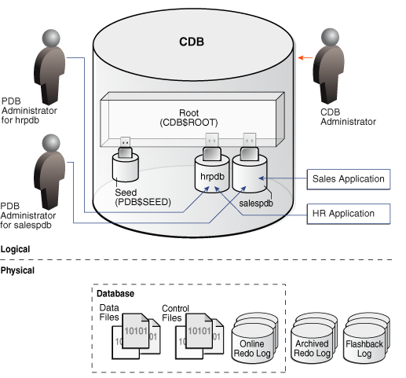
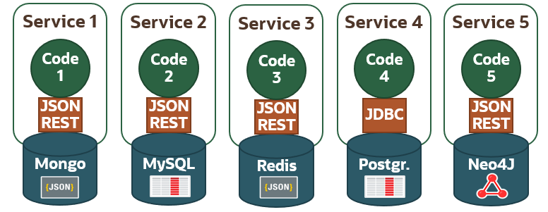
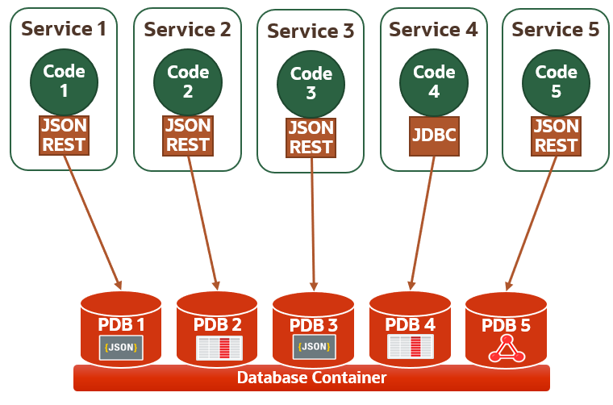
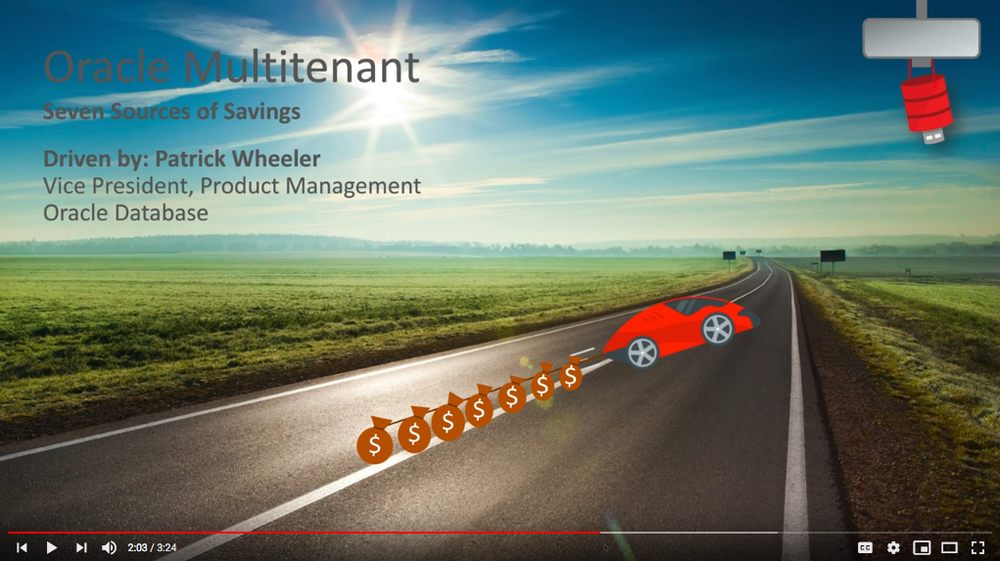
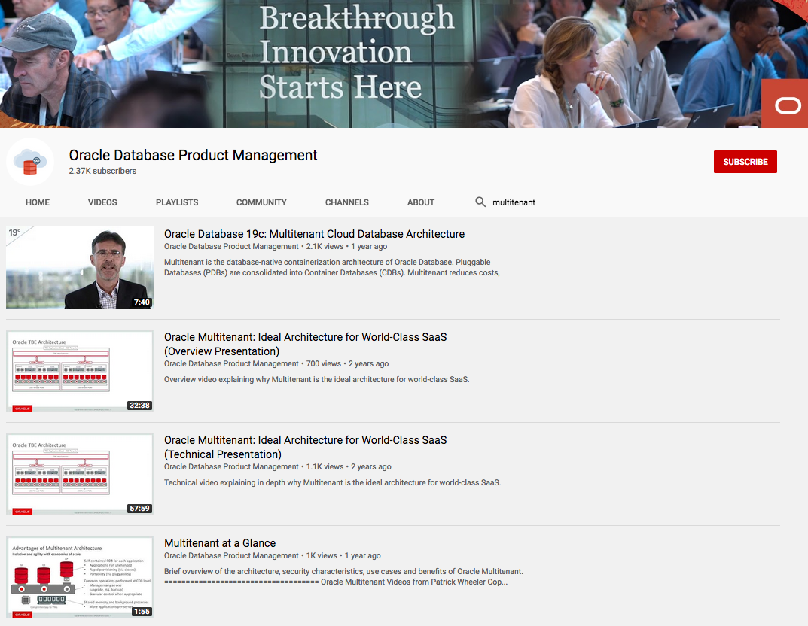

# Workshop Introduction and Overview #

## Introduction to Multitenant ##
From the point of view of an application, the PDB is the database, in which applications run unchanged. PDBs can be very rapidly provisioned and a pluggable database is a portable database, which makes it very easy to move around, perhaps for load balancing or migration to the Cloud.

Many PDBs can be plugged into a single Multitenant Container Database or CDB. From the point of view of a DBA, the CDB is the database. Common operations are performed at the level of the CDB enabling the DBA to manage many as one for operations such as upgrade, configuration of high availability, taking backups; but we retain granular control when appropriate. This ability to manage many as one enables tremendous gains in operational efficiency.

Enormous gains in technical efficiency are enabled by a shared technical infrastructure. There’s a single set of background processes and a single, global memory area – the SGA – shared by all the PDBs. The result is that with this architecture we can consolidate more applications per server.

Watch the video below for an overview of Oracle Multitenant.

## Containers and Pluggable Databases

A CDB includes zero, one, or many customer-created pluggable databases (PDBs). A PDB is a portable collection of schemas, schema objects, and nonschema objects that appears to an Oracle Net client as a non-CDB. All Oracle databases before Oracle Database 12c were non-CDBs.

A container is either a PDB or the root. The root container is a collection of schemas, schema objects, and nonschema objects to which all PDBs belong.

Every CDB has the following containers:
- Exactly one root
- Exactly one seed PDB
- User-created PDBs

## Diagram of CDBs and PDBs

The following figure shows a CDB with four containers: the root, seed, and two PDBs. Each PDB has its own dedicated application. A different PDB administrator manages each PDB. A common user exists across a CDB with a single identity. In this example, common user SYS can manage the root and every PDB. At the physical level, this CDB has a database instance and database files, just as a non-CDB does.

## Multitenant Data Consolidation and Modernization.

###  Bridging the GAP between Dev and DBAs

#### BACKGROUND

It is common to see software and hardware platforms evolve over time to be more efficient and performant at lower cost. Deployment environments using Hardware and software frameworks like Kubernetes and Docker are taking away market share from traditional Virtual Images and standalone servers.

In terms of development paradigm, Organizations are moving from Monolithic Application architecture to MicroServices and CICD ( Continuous Integration Continuous Deployments ) delivery models.

In terms of Datatype, the adoption of multiple formats like XML, JSON, Relational tables, Text docs, Spacial, Big Data , IOTs and NOSQL are getting popular.

With the proliferation of multiple players, we see (a) a plethora of data formats such as XML, JSON,(b)Data storage formats such as Spatial.

These modern approaches  are  mushrooming because it is easy to setup and accessible due to Cloud providers who readily provide the platform services.

However, this phenomenon has led to multiple issues and inefficiencies, Some of the top issue are highlighted below.

#### PROBLEM STATEMENT

We have witnessed in several customer scenarios, where the DBA is not involved in the design of the modern application. While DevOps attempts to break the silos between development and operations, there is a dire need to bring developers and DBAs together.

In a customer environment with  multiple  services dependent on heterogeneous "single trick pony" databases, these are the key problems that surface.

- High Total Cost of Ownership.
- Challenges in assuring High Availability, Security, Elasticity and Performance.
- Need for practitioners proficient in multiple  technology for data store.
- Cumbersome and time consuming mechanism  to move data across data stores.
- Inability to leverage existing DBA capability in the organization.
- Unproven technical support for mission critical production systems.

#### RECOMMENDED BLUE PRINT

In line with the evolution of  modern application architectures, Oracle has ensured continuous innovation to be ahead of the curve. Oracle provides a solution architecture that is agnostic of development environment and data representation format.

This is where Oracle Database Multitenant and DB features comes into play. Oracle DB has the native capability to support all the Modern representation formats like JSON, XML, Big data format like parquet files, Text docs, Spatial, etc.
Consolidating the data store, helps us clearly establish the segregation of responsibilities for developers & DBAs, thereby enabling the DBA to focus on  assuring database Reliability, Scalability, Availability and Security.

Oracle Pluggable database (PDB) provides an elegant model that

- can establish either "one to one" OR "consolidated" mapping for micro services in containerized environments
- can facilitate automated provisioning   of instances for developers
- helps Developers build solutions with confidence & with the assurance of reliable data store
- can scale upto 4000 instances in a cost efficient manner
- provides a flexible model where in one can either isolate or aggregate the instances depending on the need.

#### **Solution Use case :**  
The  use case below clearly illustrates the possibility of achieving  a High availability architecture at all levels of the solution stack.

- Kubernetes in a docker container environment managed by Developers
- Backend Oracle managed by DBAs

## More Information on Multitenant

Seven Sources of Savings for Companies with Multitenant

Oracle Database Product Management Videos on Multitenant

## Acknowledgements

- **Authors/Contributors** - Patrick Wheeler, David Start, Vijay Balebail, Kay Malcolm
- **Last Updated By/Date** - Kay Malcolm, March 2020
- **Workshop Expiration Date** - March 31, 2021

See an issue?  Please open up a request [here](https://github.com/oracle/learning-library/issues).
