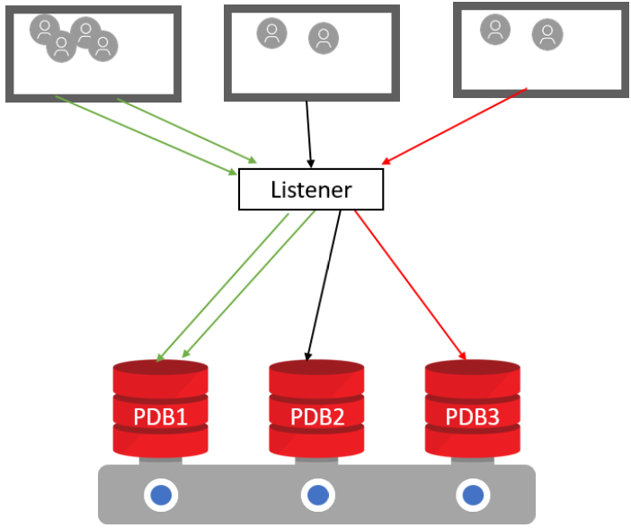

# Hands-on with Multitenant -- Network Isolation

## Lab Introduction

This is a series of hands-on labs designed to familiarize you with the  Oracle Multitenant and Network isolation feature. In these labs, We will dive into the concepts of Database Firewalls , Resource managements and Lockdown features.

### Setup

### Lab Assumptions

- Each participant has been provided a username and password to the tenancy c4u03.
- Each participant has completed the Environment Setup lab.
- Each participant has created an OCI compute instance using the database template.

There are two container databases running:

- CDB1 running on port 1523
- CDB2 running on port 1524

### Lab Setup

All the scripts for this lab are located in the /home/oracle/labs/multitenant/scripts folder.

- To access the scripts, secure shell into the OCI compute instance.

- Change to the ssh directory and ssh into your instance. The public IP address can be found by going to Compute -> Instance.

   ```
   cd /home/oracle/labs/multitenant
   ```

- Reset the container databases back to their original ports if they were changed in a previous lab. If any errors about dropping databases appear they can be ignored.

   ```
   ./resetCDB.sh
   ```


##  Database Service Firewall

Database Service Firewall is a feature of Oracle Access Control List (ACL) since 12.2.

 Service-Level ACLs allow you to control access to specific services, including those associated with individual pluggable databases (PDBs). This functionality is part of the Database Service Firewall, which isn't specifically a multitenant feature, but it is useful for controlling access to PDBs.




### SETUP STEPS

   The steps include


   - Install the ACL package
   - Configure the listener
   - Add the IPADDRESS to the whitelist for each PDB.
   - Verify/test.


####    **Step 1.  Install ACL package**

   You need a package DBMS\_SFW\_ACL\_ADMIN package. This is installed by running as sysdba. This package is owned by the DBSFWUSER schema. The procedures in this package can be run only by the DBSFWUSER user.

   ```
   <copy>sudo su - oracle

   sqlplus sys/oracle@//localhost:1523/cdb1 as sysdba  @$ORACLE_HOME/rdbms/admin/dbmsaclsrv.sql </copy>


   ```


   ```
   [opc@mtv30 ~]$ sudo su - oracle
   Last login: Mon Apr  6 21:20:38 GMT 2020 on pts/0
   [oracle@mtv30 ~]$ . oraenv
   ORACLE_SID = [CDB1] ?
   The Oracle base remains unchanged with value /u01/app/oracle
   [oracle@mtv30 ~]$ sqlplus /nolog

   SQL*Plus: Release 19.0.0.0.0 - Production on Tue Apr 7 22:35:20 2020
   Version 19.5.0.0.0

   Copyright (c) 1982, 2019, Oracle.  All rights reserved.

   SQL> conn sys/oracle@//localhost:1523/cdb1 as sysdba
   Connected.
   SQL> @$ORACLE_HOME/rdbms/admin/dbmsaclsrv.sql

   Session altered.


   Grant succeeded.


   Grant succeeded.


   Grant succeeded.


   Grant succeeded.


   Grant succeeded.


   Grant succeeded.


   Grant succeeded.


   Grant succeeded.


   Package created.


   Session altered.

   SQL>
   ```


####    **Step 2.  Configure the listener.**

   The LOCAL\_REGISTRATION\_ADDRESS\_lsnr\_alias and FIREWALL setting must be added to the "listener.ora" file. The default listener name is LISTENER and listeners on default port 1521. However In our example the CDB1 DB is listening on listener LISTCDB1. Example setting below.

   ```
   # LOCAL_REGISTRATION_ADDRESS_lsnr_alias = ON
   #LOCAL_REGISTRATION_ADDRESS_LISTENER = ON
   LOCAL_REGISTRATION_ADDRESS_LISTCDB1 = ON
   ```


   The `FIREWALL` attribute can be added to the listener endpoint to control the action of the database firewall.

   - `FIREWALL=ON` : Only connections matching an ACL are considered valid. All other connections are rejected.
   - `FIREWALL=OFF` : The firewall functionality is disabled, so all connections are considered valid.

**Take a backup of current listener.**

   You could open another termimal to take a backup.

   ```
   sudo su - oracle
   cd $ORACLE_HOME/network/admin
   cp listener.ora listener.backup
   ```


**Edit Listener.ora**

  <pre>
  LISTCDB2 =
    (DESCRIPTION_LIST =
      (DESCRIPTION =
      (ADDRESS = (PROTOCOL = TCP)(HOST = mtv28imp.sub160.vjvcn.oraclevcn.com)(PORT = 1524))
    )
  )
LISTCDB1 =
  (DESCRIPTION_LIST =
    (DESCRIPTION =
      (ADDRESS = (PROTOCOL = TCP)(HOST = mtv28imp.sub160.vjvcn.oraclevcn.com)(PORT = 1523) <b>(FIREWALL=ON)</b>)
      (ADDRESS = (PROTOCOL = IPC)(KEY = EXTPROC1523))
    )
  )

<b>LOCAL_REGISTRATION_ADDRESS_LISTCDB1 = ON </b>
</pre>


##### **Restart listener and verify FIREWALL= ON.**

```
lsnrctl stop listcdb1
lsnrctl start listener
lsnrctl status listcdb1
```
```
[oracle@mtv30 admin]$ lsnrctl stop listcdb1

LSNRCTL for Linux: Version 19.0.0.0.0 - Production on 09-APR-2020 18:49:57

Copyright (c) 1991, 2019, Oracle.  All rights reserved.

Connecting to (DESCRIPTION=(ADDRESS=(PROTOCOL=TCP)(HOST=mtv30.sub04061927430.mtw                                                                                                             orkshop.oraclevcn.com)(PORT=1523)(FIREWALL=ON)))
The command completed successfully
[oracle@mtv30 admin]$ lsnrctl start listcdb1

LSNRCTL for Linux: Version 19.0.0.0.0 - Production on 09-APR-2020 18:50:06

Copyright (c) 1991, 2019, Oracle.  All rights reserved.

Starting /u01/app/oracle/product/19c/dbhome_1/bin/tnslsnr: please wait...

TNSLSNR for Linux: Version 19.0.0.0.0 - Production
System parameter file is /u01/app/oracle/product/19c/dbhome_1/network/admin/list                                                                                                             ener.ora
Log messages written to /u01/app/oracle/diag/tnslsnr/mtv30/listcdb1/alert/log.xm                                                                                                             l
Listening on: (DESCRIPTION=(ADDRESS=(PROTOCOL=tcp)(HOST=mtv30)(PORT=1523)(FIREWA                                                                                                             LL=ON)))
Listening on: (DESCRIPTION=(ADDRESS=(PROTOCOL=ipc)(KEY=EXTPROC1523)))

Connecting to (DESCRIPTION=(ADDRESS=(PROTOCOL=TCP)(HOST=mtv30.sub04061927430.mtw                                                                                                             orkshop.oraclevcn.com)(PORT=1523)(FIREWALL=ON)))
STATUS of the LISTENER
------------------------
Alias                     listcdb1
Version                   TNSLSNR for Linux: Version 19.0.0.0.0 - Production
Start Date                09-APR-2020 18:50:06
Uptime                    0 days 0 hr. 0 min. 0 sec
Trace Level               off
Security                  ON: Local OS Authentication
SNMP                      OFF
Listener Parameter File   /u01/app/oracle/product/19c/dbhome_1/network/admin/lis                                                                                                             tener.ora
Listener Log File         /u01/app/oracle/diag/tnslsnr/mtv30/listcdb1/alert/log.                                                                                                             xml
Listening Endpoints Summary...
  (DESCRIPTION=(ADDRESS=(PROTOCOL=tcp)(HOST=mtv30)(PORT=1523)(FIREWALL=ON)))
  (DESCRIPTION=(ADDRESS=(PROTOCOL=ipc)(KEY=EXTPROC1523)))
The listener supports no services
The command completed successfully


[oracle@mtv30 admin]$ lsnrctl stat listcdb1

LSNRCTL for Linux: Version 19.0.0.0.0 - Production on 09-APR-2020 18:57:12

Copyright (c) 1991, 2019, Oracle.  All rights reserved.

Connecting to (DESCRIPTION=(ADDRESS=(PROTOCOL=TCP)(HOST=mtv30.sub04061927430.mtworkshop.oraclevcn.com)(PORT=1523)(FIREWALL=ON)))
STATUS of the LISTENER
------------------------
Alias                     listcdb1
Version                   TNSLSNR for Linux: Version 19.0.0.0.0 - Production
Start Date                09-APR-2020 18:50:06
Uptime                    0 days 0 hr. 7 min. 6 sec
Trace Level               off
Security                  ON: Local OS Authentication
SNMP                      OFF
Listener Parameter File   /u01/app/oracle/product/19c/dbhome_1/network/admin/listener.ora
Listener Log File         /u01/app/oracle/diag/tnslsnr/mtv30/listcdb1/alert/log.xml
Listening Endpoints Summary...
  (DESCRIPTION=(ADDRESS=(PROTOCOL=tcp)(HOST=mtv30)(PORT=1523)(FIREWALL=ON)))
  (DESCRIPTION=(ADDRESS=(PROTOCOL=ipc)(KEY=EXTPROC1523)))
Services Summary...
Service "CDB1" has 1 instance(s).
  Instance "CDB1", status READY, has 1 handler(s) for this service...
Service "CDB1XDB" has 1 instance(s).
  Instance "CDB1", status READY, has 1 handler(s) for this service...
Service "a206980f93d62602e0530200000ab752" has 1 instance(s).
  Instance "CDB1", status READY, has 1 handler(s) for this service...
Service "pdb1" has 1 instance(s).
  Instance "CDB1", status READY, has 1 handler(s) for this service...
The command completed successfully


It can take up to 5 minutes before all services have been registered again. If you want to speed this up, login to the CDB1 using SQL*Plus and execute the command 'alter system register'.
Once all services are available, specifically the PDB1 services, we can continue with the lab.

````

#### **Step 3: Add IP address to PDB whitelist.**

  Each policy is represented by an access control list (ACL) containing hosts that are allowed access to a specific database service. Local listeners and server processes validate all inbound client connections against the ACL.

   Once the firewall is set and listener is resarted, We will need to register the IP address of every connection that can be accepted per PDB. We are creating a whitelist of all IP address that can connect to a service. In our multitenant environment, CDB1 and PDB1 are both services. We can add additional user defined service and add whitelist to them as well.


```
 sqlplus sys/oracle@//localhost:1523/pdb1 as sysdba

SQL*Plus: Release 19.0.0.0.0 - Production on Thu Apr 9 19:03:48 2020
Version 19.5.0.0.0

Copyright (c) 1982, 2019, Oracle.  All rights reserved.

ERROR:
ORA-12506: TNS:listener rejected connection based on service ACL filtering
```

You will see that the connection fails with error ORA-12506. Since even the local host IP address is not included in the whitelist, the listener does not allow connections.
We are clearly not allowed to access this database based on the ACL filtering available. So now we are going to add our IP address to the whitelist for the (default) service PDB1.


````
<copy>
sqlplus / as sysdba
show pdbs
exec  dbsfwuser.DBMS_SFW_ACL_ADMIN.ip_add_ace('pdb1','localhost');
exec  dbsfwuser.DBMS_SFW_ACL_ADMIN.commit_acl;
</copy>

````
````
SQL>  exec dbsfwuser.DBMS_SFW_ACL_ADMIN.ip_add_ace('pdb1','localhost');
PL/SQL procedure successfully completed.

SQL> exec  dbsfwuser.DBMS_SFW_ACL_ADMIN.commit_acl;

PL/SQL procedure successfully completed.
````
Now connect using username/password from localhost to verify.

````
<copy>
conn sys/oracle@//localhost:1523/pdb1 as sysdba </copy>

SQL> conn sys/oracle@//localhost:1523/pdb1 as sysdba
Connected.
````

## Multitenant Lockdown

Tenant isolation is a key requirement for security in a multitenant environment. A PDB lockdown profile allows you to restrict the operations and functionality available from within a PDB. This can be very useful from a security perspective, giving the PDBs a greater degree of separation and allowing different people to manage each PDB, without compromising the security of other PDBs with the same instance.

A lockdown profile is a mechanism to restrict certain operations or functionalities in a PDB. This new Multitenant feature is managed by a CDB administrator and can be used to restrict user access in a particular PDB. A lockdown profile can prevent PDB users from:

Executing certain SQL statements, such as ALTER SYSTEM and ALTER SESSION,

Running procedures that access the network (e.g. UTL\_SMTP, UTL\_HTTP),
Accessing a common user’s objects,
Interacting with the OS (In addition to the capabilities covered by PDB_OS_CREDENTIAL),
Making unrestricted cross-PDB connections in a CDB,
Taking AWR snapshots,
Using JAVA partially or as a whole,
Using certain database options such as Advanced Queueing and Partitioning.

We can fulfill these requirements by creating a lockdown profile in our CDB Root and adding these restrictions to it. Before we move onto the “How?” part of this discussion, it’s worth mentioning a couple of important details about lockdown profiles:
We can fulfill these requirements by creating a lockdown profile in our CDB Root and adding these restrictions to it. Before we move onto the “How?” part of this discussion, it’s worth mentioning a couple of important details about lockdown profiles:

In order to be able to create a lockdown profile, you have to be a common user with CREATE LOCKDOWN PROFILE privilege and in order to enable a lockdown profile (either at the CDB or PDB level), you have to be common user with common ALTER SYSTEM or common SYSDBA privilege.

A single lockdown profile can have several rules defined in it. In other words, you don’t have to create a lockdown profile for every restriction you want to implement.

A PDB can have only one lockdown profile active at a time.

The restrictions enforced by a lockdown profile are PDB-wide, they affect every single user including the SYS and SYSTEM.

If you enable a lockdown profile in CDB Root, it affects all PDBs in the CDB. If you enable it in an Application Root (App Root), it affects all Application PDBs (App PDBs) under that App Root. If you enable it within a PDB, it only affects that PDB.


The steps are
-  Create lockdown profile
-  add statements to the lockdown profile which are disabled.


##### create a lockdown profile.

````
conn / as sysdba
show con_name
show pdbs

create lockdown profile TENANT_LOCK;
````

##### Add restrictions to profile

You can lockdown options such as partitions option or lockdown statements like alter system.
Eg alter lockdown profile sec_profile disable option=('Partitioning');

You can restrict all statements by using the "ALL" clause.
eg.  alter lockdown profile sec_profile disable statement=('alter system') clause=('set') option all;.

 The scope of the restriction can be reduced using the  CLAUSE, OPTION, MINVALUE, MAXVALUE options and values.
 <pre>
 eg. ALTER LOCKDOWN PROFILE hr_prof
     DISABLE STATEMENT = ('ALTER SYSTEM')
          CLAUSE = ('SET')
          OPTION = ('CPU_COUNT')
          MINVALUE = '2'
          MAXVALUE = '6';</pre>


As a first example, we will prevent a PDB to change the settings for the parameter CURSOR_SHARING. Changing this parameter could cause changes in performance and behavior of the entire CDB. Adding a rule to the newly created TENANT\_LOCK lockdown profile is done with an ALTER LOCKDOWN PROFILE command. We will also lockdown the use of partitioning option into the lockdown profile.

````
alter lockdown profile TENANT_LOCK disable statement=('alter system') clause=('set') option=('cursor_sharing');

alter lockdown profile TENANT_LOCK disable option=('Partitioning');

````
````
SQL> alter lockdown profile TENANT_LOCK disable statement=('alter system') clause=('set') option=('cursor_sharing');
Lockdown Profile altered.
SQL> alter lockdown profile TENANT_LOCK disable option=('Partitioning');
Lockdown Profile altered.
````
Information about PDB lockdown profiles can be displayed using the DBA_LOCKDOWN_PROFILES view. You can use variations on the following query to check the impact of some of the commands used in this article. You may want to alter the format of the columns, depending on what you are trying to display.
````
SET LINESIZE 200
COLUMN rule_type FORMAT A20
COLUMN rule_type FORMAT A10
COLUMN rule format a13
COLUMN clause FORMAT A5
COLUMN clause_option FORMAT A15

select profile_name, rule_type, rule, clause, clause_option, status, users from DBA_LOCKDOWN_PROFILES;
````
````
SQL> select profile_name, rule_type, rule, clause, clause_option, status, users from DBA_LOCKDOWN_PROFILES;

PROFILE_NAME         RULE_TYPE  RULE          CLAUS CLAUSE_OPTION   STATUS  USERS
-------------------- ---------- ------------- ----- --------------- ------- ------
PRIVATE_DBAAS                                                       EMPTY
PUBLIC_DBAAS                                                        EMPTY
SAAS                                                                EMPTY
TENANT_LOCK          OPTION     PARTITIONING                        DISABLE ALL
TENANT_LOCK          STATEMENT  ALTER SYSTEM  SET   CURSOR_SHARING  DISABLE ALL
````

Connect to container PDB1 and display the value of CURSOR_SHARING
````
alter session set container=PDB1;
show parameter cursor_sharing
````
````
SQL>  alter session set container=PDB1;
Session altered.

SQL> show parameter cursor_sharing
NAME                                 TYPE        VALUE
------------------------------------ ----------- ------------------------------
cursor_sharing                       string      EXACT
SQL>
````
Change the value oF CURSOR_SHARING to FORCE
````
SQL> <copy> alter system set cursor_sharing = FORCE; </copy>

System altered.

````
We have set the TENANT\_LOCK lockdown profile to prevent creation tables with partitions.
create a partitioned table before the profile is enabled.
````
SQL><copy> create table MyTable01 (id number) partition by hash (id) partitions 2;</copy>

Table created.
````
Since the lockdown profile has not been activated for this PDB, we can still change the parameter if we have enough permissions to do so.

Enable the LOCKDOWN profile TENANT_LOCK

````
SQL> <copy>alter system set PDB_LOCKDOWN=TENANT_LOCK;</copy>
System altered.
````
Now, try to change the value of  CURSOR_SHARING back to EXACT

````
SQL> <copy>alter system set cursor_sharing=EXACT;<copy>
alter system set cursor_sharing=EXACT
*
ERROR at line 1:
ORA-01031: insufficient privileges
````
Test to see if you can create a partitioned table when the profile is enabled.
````
SQL> <copy>create table MyTable02 (id number) partition by hash (id) partitions 2;</copy>
create table MyTable02 (id number) partition by hash (id) partitions 2
*
ERROR at line 1:
ORA-00439: feature not enabled: Partitioning

````
As you can see , We are not able to create a partitioned table even with SYS privileges.
